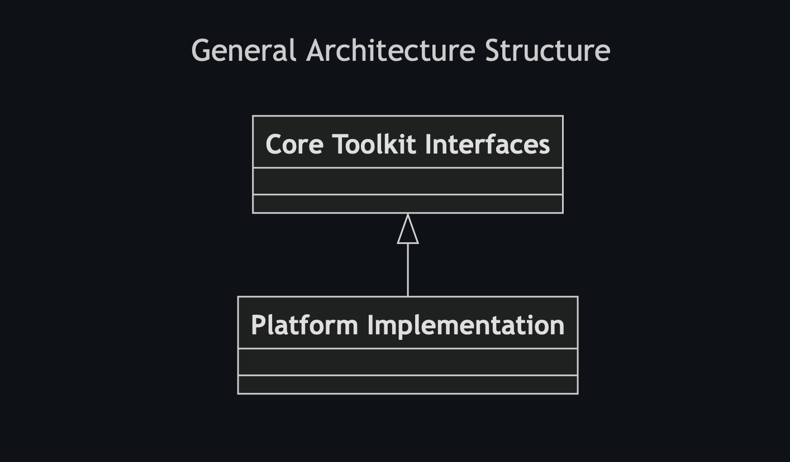
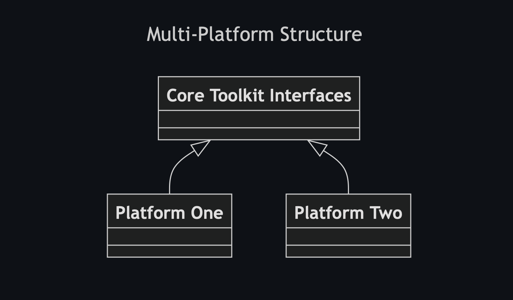
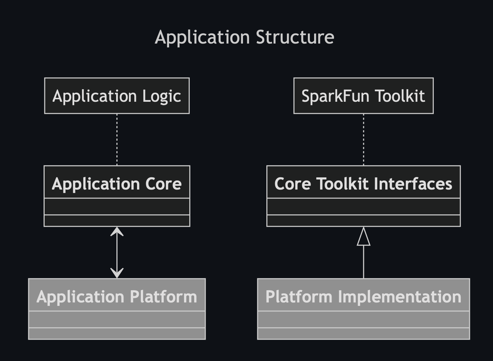

# SparkFun Toolkit Arduino Library


The SparkFun Toolkit provides a common set of core functionality for use across the spectrum of SparkFun developed embedded libraries and applications. It provides a well tested, extensively used, and abstract foundational layer of functionality to use across a wide-range of solutions. 

This, the first iteration of the SparkFun Toolkit focuses on device communication - namely the communication between a embedded microprocessor and a peripheral devices. Focusing on the *communication bus* aspect of embedded development, the toolkit simplifies system development by providing a proven bus implementation, as well as a set of abstract interfaces that enable rapid development of multi-bus type implementations. 

In addition to providing a set of common device bus communication functionality, the SparkFun Toolkit is structure to provide a *platform independent* solution. While the initial implementation targets Arduino development, the architecture is patterned to define a common core of functionality and interfaces that are platform agnostic. Use of the SparkFun Toolkit within a non-Arduino, c++ environment, requires the implementation of small set of platform specific functionality. 

## Motivation

Often, the same core functionality is implemented within a majority of our Arduino libraries, with each implementation providing the same functionality, but implemented differently.  The result of this are different solutions that delivery the same functionality, but each have  their unique quirks and behavior oddities. As this implementation patter expands, it becomes impossible to maintain/support effectively. 

An example of this is software libraries provided in support of the SparkFun qwiic ecosystem. With over 200 sensors, input devices and accessories, the implementation and maintenance of the driver communication layers are difficult burden that the SparkFun Toolkit addresses. 

## The SparkFun Toolkit

The SparkFun Toolkit provides a single implementation of common functionality used in the software developed for SparkFun boards. Initially targeted  at the Arduino development environment, the SparkFun Toolkit delivers the following benefits:

* Use a well-tested and validated implementation
* Reduce development effort
* Implement functionality following a common structure
* Designed following a platform independent architectural pattern
* Set the foundation for future enhancements - as the capabilities of the toolkit grow, these features become available with little to any implementation effort.

### General Architecture

Implemented using C++, the SparkFun toolkit follows a simple two layered approach in it's design: A core foundational layer, and a platform specific layer. 



And as additional platforms are added, they also implement/inherit from the SparkFun Toolkit Core.



When using the SparkFun Toolkit, the intent is for the implementation to follow the same pattern: A platform independent layer that works with the SparkFun Toolkit core, and a platform specific layer that utilizes the SparkFun Toolkit platform specific implementation. 



If/when the application is moved to another platform, just the platform specific logic needs implementation. 

## Documentation

The SparkFun Toolkit Development documentation is available [here](https://docs.sparkfun.com/SparkFun_Toolkit). This includes doxygen generated class/API documentation, as well as additional architectural details.

## Examples

The best way to understand and use the SparkFun Toolkit is to see it being used on other libraries. For our SparkFun developed libraries and firmware that use the SparkFun Toolkit, their associated github repositories are tagged with [sparkfun-toolkit](https://github.com/topics/sparkfun-toolkit) tag. 


## Installation and Use

To use the SparkFun Toolkit directly, or in library development kit is installable via the Arduino Library Manager - search for `SparkFun ToolKit` within the Arduino Library Manager to install.

However, for solutions that use the SparkFun Toolkit, it is installed automatically during the Arduino library installation process, by marking the Toolkit as a dependency when publishing your library.

To mark the `SparkFun Toolkit` as a dependency, add the following line to the `library.properties` file for your library. 

```INI
depends=SparkFun Toolkit (>=1.0.0)
```

> [!NOTE]
> A version indicator is included to ensure your library uses the correct version of the toolkit.

