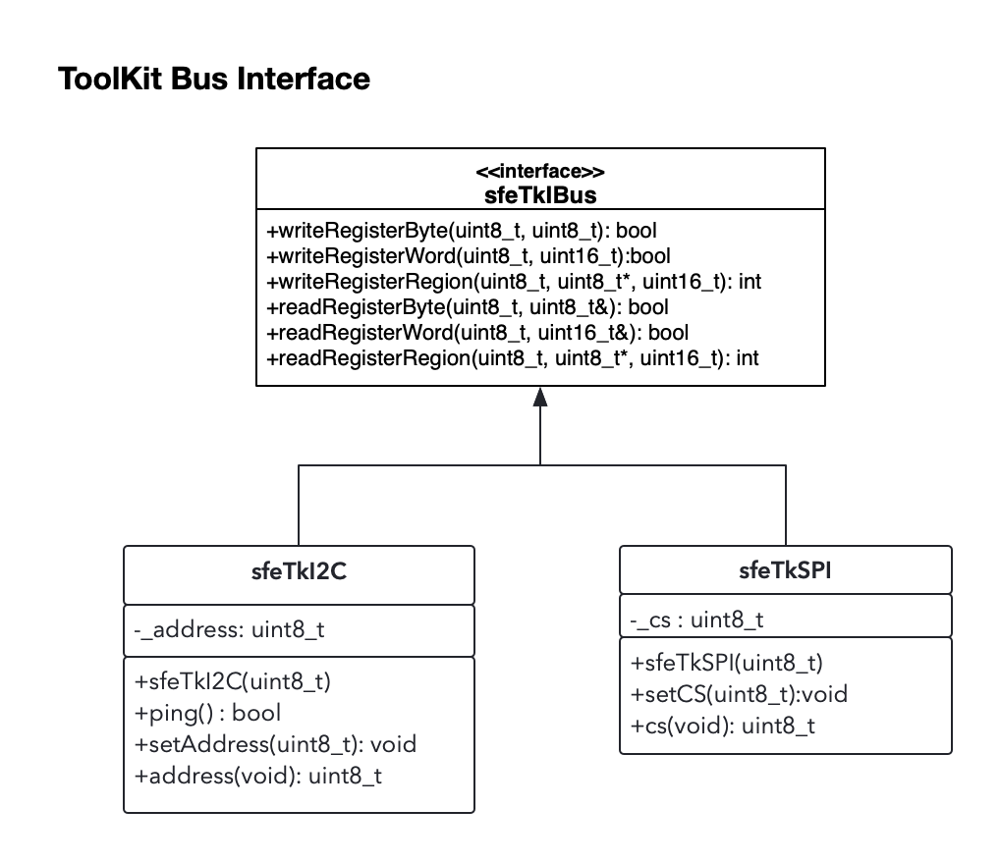

# Overview - Device Bus interface - sfeTkIBus

One of the foundational capabilities of the SparkFun Toolkit is bus communication with devices. This is a common task almost all libraries implement using their own implementation for I2C, SPI or UART bus communication.

For bus communication, the SparkFun Toolkit is designed to provide a common implementation for use across all SparkFun libraries. Additionally, the bus architecture is modeled on a *driver* pattern, separating  the individual bus setup/configuration from data communication, enabling a single device implementation to easily support a variety of device bus types.

The key goals set for the Bus implementation in the Toolkit include:

* Separate device setup from device communication
* Define a common bus interface for use across a variety of common device bus types
* Deliver support for both SPI and I2C bus types initially, focusing on Arduino
* Structure the bus/toolkit implementation such that it's platform independent

## Architecture Overview

To meet the goals for this subsystem, the Flux framework follows a ***Driver Pattern***, defining a common interface for bus communication. Device drivers are designed around this interface, leaving bus configuration and implementation to platform specific implementation.

The key class to support this pattern are:

| | |
|------|-------|
**sfeTkIBus** | A virtual C++ class that device the bus ```sfeTkIBus``` interface |
**sfeTkII2C** | Sub-class of the ```sfeTkIIBus``` interface, it provides an interface for I2C devices|
**sfeTkISPI** | Sub-class of the ```sfeTkIIBus``` interface, it provides an interface for SPI devices |

### The sfeTkIBus Interface

The key to meeting the goals of the Toolkit is the IBus interface. This interface defines the  methods used to communicate with a device. The setup, configuration and implementation of this interface is performed by platform specific implementations of the interface.

The interface methods:

| Method| Definition |
|------|-------|
**writeRegisterByte** | Write a byte of data to a particular register of a device |
**writeRegisterWord** | Write a word of data to a particular register of a device |
**writeRegisterRegion** | Write an array of data to a particular register of a device|
**readRegisterByte** | Read a byte of data from a particular register of a device |
**readRegisterWord** | Read a word of data from a particular register of a device |
**readRegisterRegion** | Read an array of data from a particular register of a device |

### The sfeTkII2C Implementation

This class sub-classes from the ```sfeTkIBus``` interface adding additional functionally focused on supporting an I2C implementation. This interface provides the additional functionality.

| Method| Definition |
|------|-------|
**ping** | Determine if a devices is connected to the I2C device at the address set on this bus object. This is an interface method |
**setAddress** | Set the I2C address to use for this I2C object |
**address** | Returns the address used by this I2C object |

> Note: The ```sfeTkII2C``` class manages the I2C address

### The sfeTkISPI Implementation

This class sub-classes from the ```sfeTkIBus``` interface adding additional functionally focused on supporting an SPI implementation. This interface provides the additional functionality.

| Method| Definition |
|------|-------|
**setCS** | Set the CS Pin to use for this SPI object |
**cs** | Returns the CS Pin used by this SPI object |

> Note: The ```sfeTkISPI``` class manages the CS Pin

The class diagram of these base class interfaces/implementation:



## sfeTkIBus Use

The general steps when using the sfeTkIBus in device development are outlined in the following steps

### Platform Independent/Bus Independent Driver

Develop a platform independent version of a device driver that commutates using the sfeTkIBus interface. This driver should include a method to set the bus object, accepting a pointer to a sfeTkIBus interface/object. Actual bus setup is provided outside of the driver.

This implementation would take the following form:

```c++

class myDriverClass
{
public:

    myDriverClass(uint8_t address) : _addr{address}{}

    bool begin()
    {
        // initialize things ...

        return true;
    }
    void setCommunicationBus(sfeTkIBus *theBus)
    {
        _theBus = theBus;
    }

    bool updateDeviceData(uint8_t *data, size_t len)
    {
        if (!_theBus || !data || len == 0)
            return false;

        int status = _theBus->writeRegisterRegion(THE_REG, data, len);

        return (status == 0);
    }

    bool checkDeviceID()
    {
        // do some device ID checks in registers ...etc
        return true;
    }
private:
    sfeTkIBus *_theBus;
};
```

### Write a Platform Specific Driver, based on the core driver

This driver sub-classes from the general/core driver class, builds and configures the desired bus object and passes this into the core driver.

Basic concept - creating an I2C class in Arduino

```c++

class myArduinoDriverI2C : public myDriverClass
{
  public:
    myArduinoDriverI2C()
    {}
   
    bool begin()
    {
        if (!_theI2CBus.init(MY_DEVICE_ADDRESS))
            return false;
        setCommunicationBus(&_theI2CBus);

        return myDriverClass::begin();
    }

    bool ping()
    {
        if (!_theI2CBus.ping())
            return false;

        return checkDeviceID();
    }

private:
   sfeTkArdI2C _theI2CBus;
};
```

Basic concept - creating an SPI class in Arduino

```c++

class myArduinoDriveSPI : public myDriverClass
{
  public:
    myArduinoDriverSPI()
    {}

    bool begin()
    {
        SPISettings spiSettings = SPISettings(4000000, MSBFIRST, SPI_MODE3);

        if (!_theSPIBus.init(SPI, spiSettings, MY_DEFAULT_CS, true))
            return false;
        setCommunicationBus(&_theSPIBus);

        return myDriverClass::begin();
    }

    bool ping()
    {
        return checkDeviceID();
    }

private:
   sfeTkArdSPI _theSPIBus;
};
```
