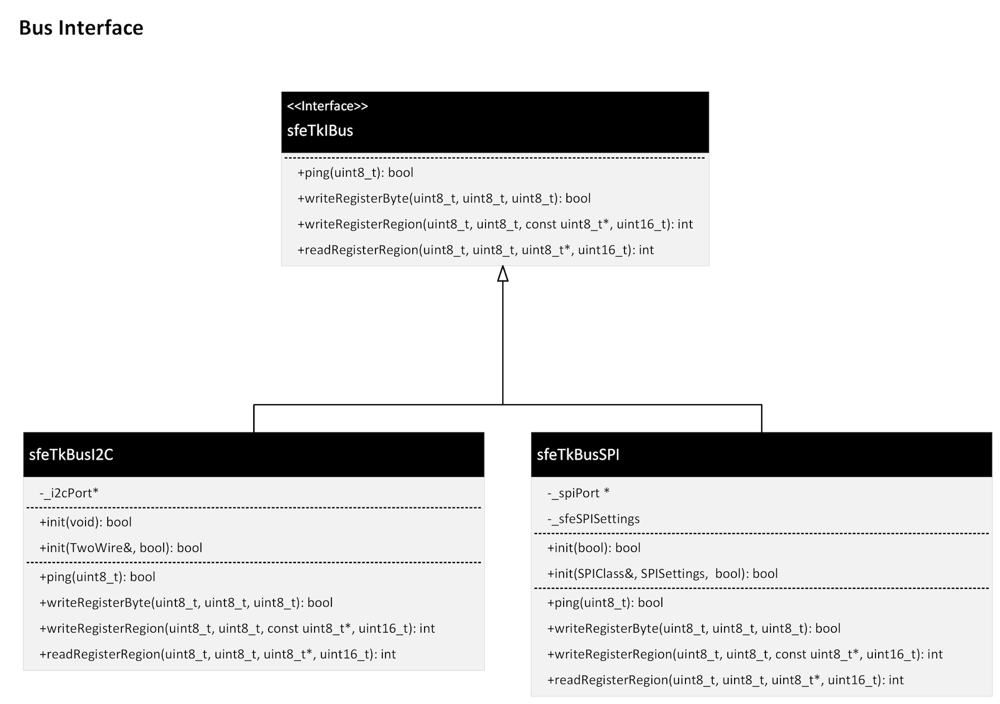

# Overview - Device Bus interface - sfeTKIBus

One of the foundational capabilities of the SparkFun Toolkit is bus communication with devices. This is a common task almost all libraries implement using their own implementation for I2C, SPI or UART bus communication.

For bus communication, the SparkFun Toolkit is designed to provide a common implementation for use across all SparkFun libraries. Additionally, the bus architecture is modeled on a *driver* pattern, separating  the individual bus setup/configuration from data communication, enabling a single device implementation to easily support a variety of device bus types.

The key goals set for the Bus implementation in the Toolkit include:

* Separate device setup from device communication
* Define a common bus interface for use across a variety of common device bus types
* Deliver support for both SPI and I2C bus types initially, focusing on Arduino
* Structure the bus/toolkit implementation such that it's platform independent

## Architecture Overview

To meet the goals for this subsystem, the Flux framework follows a ***Driver Pattern***, defining a common interface for bus communication. Device drivers are designed around this interface, leaving bus configuration and implementation to platform specific implementation.

The key class to support this pattern are:

| | |
|------|-------|
**sfeTkIBus** | A virtual C++ class that device the bus ```sfeTkIBus``` interface |
**sfeTkBusI2C** | Provides an Arduino I2C implementation for the toolkit |
**sfeTkBusSPI** | Provides an Arduino SPI implementation for the toolkit |

### The sfeTkIBus Interface

The key to meeting the goals of the Toolkit is the IBus interface. This interface defines the  methods used to communicate with a device. The setup, configuration and implementation of this interface is performed by platform specific implementations of the interface.

The interface methods:

| Method| Definition |
|------|-------|
**ping** | A method used to determine if a device is connected to the bus |
**writeRegisterByte** | Write a byte of data to a particular register of a device |
**writeRegisterRegion** | Write an array of data to a particular register of a device|
**readRegisterRegion** | Read an array of data from a particular register of a device |

### Arduino Implementation

The first implementation of the IBus interface is for the Arduino development environment, as noted above. The implementation consists of two classes, ```sfeTkBusI2C``` and ```sfeTkBusSPI```, each implementing the sfeTkIBus interface using the Arduino SDK.

The results is outlined in the following class diagram:


