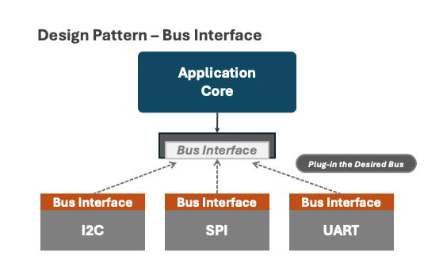

# Device Bus Interface - Overview

One of the foundational capabilities of the SparkFun Toolkit is bus communication with devices. This is a common task almost all libraries implement using their own implementation for I2C, SPI or UART bus communication.

For bus communication, the SparkFun Toolkit is designed to provide a common implementation for use across all SparkFun libraries. Additionally, the bus architecture is modeled on a *driver* pattern, separating  the individual bus setup/configuration from data communication, enabling a single device implementation to easily support a variety of device bus types.

## The Bus Interface Design Pattern

This pattern allows an application to develop against the common bus interface without regard to the underlying bus type or implementation. This *plug-in* nature of this model enables core application reuse across a range of bus devices. What to use a different bus type? Just use a different driver.

This pattern is show in the following diagram:



This pattern extends across different platforms, allowing a common platform independent application core to utilize platform specific bus drivers.


The platform dependant drivers implement the core Bus Interface (IBus) for communication, with platform specific setup and management left to the underlying implementation. Since the application core only works with the Bus Interface, if implemented correctly, the same core works across different bus types and across different development environments.

## Goals

For the initial implementation the key goals set for the Bus implementation in the Toolkit include:

* Separate device setup from device communication
* Define a common bus interface for use across a variety of common device bus types
* Deliver support for both SPI and I2C bus types initially, focusing on Arduino
* Structure the bus/toolkit implementation such that it's platform independent

## Architecture Overview

As outlined above, the SparkFun Toolkit follows a ***Driver Pattern***, defining a common interface for bus communication. Device drivers are designed around this interface, leaving bus configuration and implementation to platform specific implementation.

The key class to support this pattern are:

| | |
|------|-------|
|**sfTkIBus** | A virtual C++ class that device the bus ```sfeTkIBus``` interface |
|**sfTkII2C** | Sub-class of the ```sfeTkIIBus``` interface, it provides an interface for I2C devices|
|**sfTkISPI** | Sub-class of the ```sfeTkIIBus``` interface, it provides an interface for SPI devices |

### The sfTkIBus Interface

The key to meeting the goals of the Toolkit is the IBus interface. This interface defines the  methods used to communicate with a device. The setup, configuration and implementation of this interface is performed by platform specific implementations of the interface.

The bus implements methods that perform the following

| Method| Definition |
|------|-------|
|**writeRegister(...)** | Overloaded set of methods to write data to a specified register|
|**readRegister(...)** | Overloaded set of methods to read data from a specified register|
|**writeData(...)** | An overloaded set of methods to write data directly to the device|

Additionally a set of explicitly named methods for different core types are provided.

> [!NOTE]
> This interface only defines the methods to read and write data on the given bus. Any address, or bus specific settings is provided/implemented by the implementation/specialization of this interface.

Specific details for this class are detailed [here](https://docs.sparkfun.com/SparkFun_Toolkit/classsf_tk_i_bus.html)

### The sfTkII2C Implementation

This class sub-classes from the ```sfTkIBus``` interface adding additional functionally focused on supporting an I2C implementation. This class does not implement the IIBus interface, so it's abstract, but the class adds the additional functionality.

| Method| Definition |
|------|-------|
|**ping** | Determine if a devices is connected to the I2C device at the address set on this bus object. This is an interface method |
|**setAddress** | Set the I2C address to use for this I2C object |
|**address** | Returns the address used by this I2C object |

> [!NOTE]
> The ```sfTkII2C``` class manages the device address for the I2C bus. As such, each I2C device instantiates/uses an instance of the ```sfTkII2C``` class.

The details for the ```sfeTkII2C``` interface are [here](https://docs.sparkfun.com/SparkFun_Toolkit/classsf_tk_i_i2_c.html)

### The sfeTkISPI Implementation

This class sub-classes from the ```sfTkIBus``` interface adding additional functionally focused on supporting an SPI implementation. This interface provides the additional functionality.

| Method| Definition |
|------|-------|
|**setCS** | Set the CS Pin to use for this SPI object |
|**cs** | Returns the CS Pin used by this SPI object |

> [!NOTE]
> The ```sfeTkISPI``` class manages CS Pin for the SPI bus. As such, each SPI device instantiates/uses an instance of the ```sfeTkISPI``` class.

The details for the ```sfTkII2C``` interface are [here](https://docs.sparkfun.com/SparkFun_Toolkit/classsf_tk_i_s_p_i.html)

## sfTkIBus - Arduino Implementation

The initial implementation of the toolkit IBus interface is for the Arduino environment. This implementation consists of two classes, ```sfTkArdI2C``` and ```sfTkArdSPI```, each of which sub-class from their respective bus type interfaces within the core toolkit.

These driver implementations provide the platform specific implementation for the toolkit bus interfaces, supporting the methods defined by the interfaces, as well as contain and manage the platform specific settings and attributes for each bus type.

> [!IMPORTANT]
> The intent is that each user of an particular - a device in most cases - contains an instance of the specific bus class.

### The sfTkArdI2C Class

This class provides the Arduino implementation of I2C in the SparkFun Toolkit. It implements the methods of the ```sfTkIBus``` and ```sfTkII2C``` interfaces, as well as manages any Arduino specific state.

Details for this class are located [here](https://docs.sparkfun.com/SparkFun_Toolkit/classsf_tk_ard_i2_c.html)

### The sfTkArdSPI Class

This class provides the Arduino implementation of SPI in the SparkFun Toolkit. It implements the methods of the ```sfTkIBus``` and ```sfTkISPI``` interfaces, as well as manages any Arduino specific state for the SPI bus - namely the SPISettings class.

Before each use of the SPI bus, the methods of the ```sfTkArdSPI``` uses an internal SPISettings class to ensure the SPI bus is operating in the desired mode for the device.

Details for this class are located [here](https://docs.sparkfun.com/SparkFun_Toolkit/classsf_tk_ard_s_p_i.html)

## sfTkIBus Use

The general steps when using the sfTkIBus in device development are outlined in the following steps. This example uses the Arduino implementation of the bus.

The general pattern for a device driver implementation that uses the SparkFun Toolkit is the following:

### Implement a Platform Independent Driver

The first step is to implement a core, platform independent version of the driver that communicates to the target device using the methods of a ```sfTkIBus``` interface. By limiting use to the IBus interface, the core implementation can use any bus type or platform that implements the sfeTkIBus interface.

> [!IMPORTANT]
> At this level, the driver is only using a ```sfTkIBus``` interface, not any specific bus implementation.

This driver has the following unique functionality:

1) A method to set the object that implements the ```sfTkIBus``` interface object should use or sets the bus in a ```begin()``` method.
1) If the device supports identification capabilities, the driver provides this functionality.

#### Simple Example of an Independent Driver Implementation

> [!NOTE]
> This code is **pseudo-code**, used to demonstrate the key concepts of the implementation pattern.

This implementation would take the following form:

```cpp

class myDriverClass
{
public:

    myDriverClass() : _theBus{nullptr}{}

    sfTkError_t begin(sfTkBus *theBus = nullptr)
    {
        // initialize things ...

        if (_theBus == nullptr)
            return ksfTkErrFail;

        _theBus = theBus;
        return ksfTkErrOk;
    }

    sfTkError_t updateDeviceData(uint8_t *data, size_t len)
    {
        if (!_theBus || !data || len == 0)
            return ksfTkErrFail;

        return _theBus->writeRegister(THE_REG, data, len);

        return (status == kSTkErrOk);
    }

    sfTkError_t checkDeviceID()
    {
        // do some device ID checks in registers ...etc
        return kSTkErrOk;
    }
    // and additional methods for the driver ..
    sfTkError_t doSomethingA(int32_t);
    sfTkError_t getValueA(uint32_t&);
    sfTkError_t setPropertyB(double);


private:

    sfeTkIBus *_theBus;
};
```

### Write a Platform Specific Driver, based on the core driver

This driver sub-classes from the general/core driver class, builds and configures the desired bus object and passes this into the core driver.

The key concepts for these Platform specific drivers include:

1) Perform any platform specific bus setup during the instantiation of the device. This might just be setting the target (pin, address) for the device on the bus.
1) Implement any bus specific device identification use at this level. For example, on I2C, a ping call might be made on the bus before a more detailed identification method is used.

#### Basic concept - creating an I2C class in Arduino

The following is an example of an I2C class in Arduino based on the previous platform independent driver.

> [!NOTE]
> This class implements a ```isConnected()``` method that calls the ```ping()``` method of the I2C bus class being used, and if this passes, then calls the ```checkDeviceID()``` method of the superclass.

> [!NOTE]
> If your device supports repeated starts, make sure to include ```_theI2CBus.setStop(false)``` in your begin function. Otherwise this can cause issues with your device.

```cpp

class myArduinoDriverI2C : public myDriverClass
{
  public:
    myArduinoDriverI2C()
    {}
   
    bool begin(const uint8_t address = SF_BMV080_DEFAULT_ADDRESS, TwoWire &wirePort = Wire)
    {
        if (_theI2CBus.init(wirePOrt, MY_DEVICE_ADDRESS) != ksfTkErrOk)
            return false;

        // OPTIONAL: If your device supports repeat starts.
        _theI2CBus.setStop(false);

        return myDriverClass::begin(&_theI2CBus);
    }

    bool isConnected()
    {
        if (_theI2CBus.ping() != ksfTkErrOk)
            return false;

        return checkDeviceID() == kstTkErrOk;
    }

private:
   sfTkArdI2C _theI2CBus;
};
```

#### Basic concept - creating an SPI class in Arduino

The following is a SPI version of the driver implemented in Arduino. While similar to the I2C implementation, it focuses on the specific needs of the SPI bus, specifically the ```SPISettings``` this particular device requires when using the SPI bus.

> [!NOTE]
> This class implements a ```isConnected()``` method that just calls the superclasses  ```checkDeviceID()``` method to determine if the device is available on the bus.

```cpp

class myArduinoDriveSPI : public myDriverClass
{
  public:
    myArduinoDriverSPI()
    {}

    bool begin(uint8_t csPin, SPIClass &spiPort = SPI,
               SPISettings spiSettings = SPISettings(4000000, MSBFIRST, SPI_MODE0))
    
    {

        if (_theSPIBus.init(spiPort, spiSettings, csPin, true) != ksfTkErrOk)
            return false;

        return myDriverClass::begin(&_theSPIBus) == ksfTkErrOk;
    }

    bool isConnected()
    {
        return checkDeviceID() == ksfTkErrOk;
    }

private:
   sfTkArdSPI _theSPIBus;
};
```

> [!IMPORTANT]
>The I2C and SPI versions of the driver just manage the specific bus setup and  initialization - beyond that, the core class, which ***only*** operates using the bus interface class forms the core of both implementations. 

## Summary

In summary, the SparkFun Toolkit Bus Interface sets a standard that device drivers can implement against without concern for platform or bus type. Using common interface implementation patterns, the implementation delivers on the goals for this subsystem - namely:

* Separate device setup from device communication
* Define a common bus interface for use across a variety of common device bus types
* Deliver support for both SPI and I2C bus types initially, focusing on Arduino
* Structure the bus/toolkit implementation such that it's platform independent
